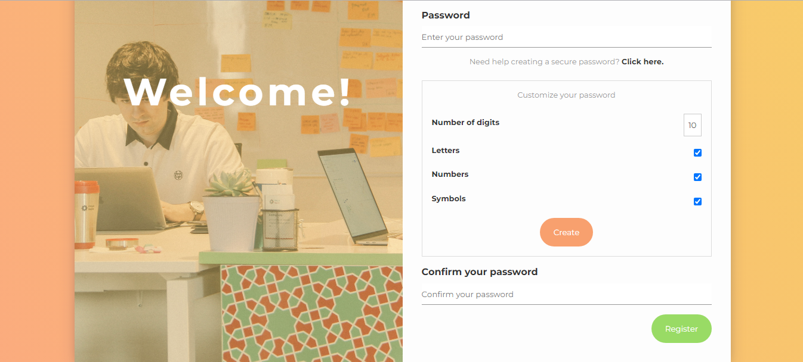

# Password Generator

An account creation page with personalized password generation, where the user has the option of including letters, numbers and symbols, as well as limiting the length of the generated password. Additionally, a button is available to copy it to the clipboard.

The technologies used were HTML, CSS and JavaScript, exploring general concepts and good practices of the trio of web languages.

## How to use

1. Open the `index.html` file in your browser, click on the `Click here` span to open custom password options.

2. Fill in the fields with the desired options, then click on the `Create` button to generate your custom password.

3. Click on the `Copy` button to copy the generated password to the clipboard. And be happy with your new password!

